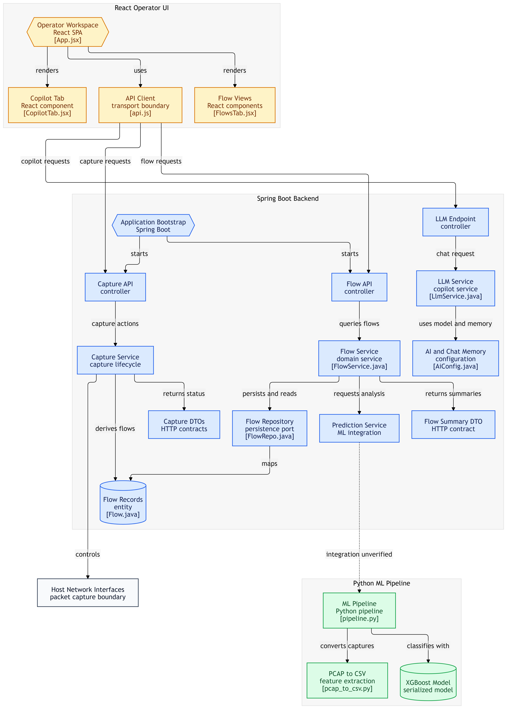

# NetGuard Copilot

**AI-Assisted Network Intrusion Detection System**

NetGuard Copilot is a network intrusion detection platform that captures live traffic, classifies flows with a machine learning model, and surfaces the results through an operator dashboard with an LLM-powered chat copilot for analysis and triage.

The system combines a Python packet-capture and ML pipeline (XGBoost trained on the CICIDS dataset), a Spring Boot backend, and a React operator interface.

---

## Table of Contents

- [Overview](#overview)
- [Features](#features)
- [System Architecture](#system-architecture)
- [Data Pipeline](#data-pipeline)
- [Backend Design](#backend-design)
- [Frontend Design](#frontend-design)
- [AI Copilot](#ai-copilot)
- [Technology Stack](#technology-stack)
- [Current Status & Limitations](#current-status--limitations)
- [Future Work](#future-work)
- [Project Highlights](#project-highlights)

---

## Overview

Traditional intrusion detection tooling tends to be either heavyweight enterprise software or raw packet-analysis tools with no operator-friendly interface. NetGuard Copilot is built as a lightweight, single-operator system that:

- Captures live traffic from host network interfaces
- Converts captures into flow records in CICIDS format
- Classifies flows using a pretrained XGBoost model
- Persists and exposes flow data through a REST API
- Lets an operator query and discuss detected flows with an LLM-based copilot

The system was originally developed for a network-security hackathon and has since been carried forward as a standalone portfolio project.

```text
Host Network Interfaces
         │  packet capture
         ▼
   Python ML Pipeline
         │  flow records + classification
         ▼
   Spring Boot Backend
         │  REST API
         ▼
   React Operator UI
```

---

## Features

- Live packet capture from host network interfaces
- Automated conversion of captures into flow records
- ML-based traffic classification using a trained XGBoost model
- Flow history and summaries exposed via REST API
- Operator dashboard for reviewing captured and classified flows
- LLM-powered copilot for natural-language analysis of flow data
- Timestamp-based incremental polling for near real-time updates

---

## System Architecture

The system is organized into three layers: a React operator interface, a Spring Boot backend, and a Python ML pipeline, connected through REST APIs and a shared flow-record store.



**High-level flow:**

```text
React Operator UI (App.jsx)
   ├── Copilot Tab      → copilot requests
   ├── Flow Views       → flow requests
   └── API Client       → capture requests
                │
                ▼
      Spring Boot Backend
   ┌────────────┼─────────────────┐
   ▼            ▼                 ▼
Capture API   Flow API      LLM Endpoint
Controller    Controller    Controller
   │            │                 │
   ▼            ▼                 ▼
Capture      Flow Service    LLM Service
Service      (FlowService)   (copilot chat)
   │            │                 │
   ▼            ▼                 ▼
Host Network  Flow Repository  AI + Chat Memory
Interfaces    → Flow Records   Configuration
              (Flow entity)
```

---

## Data Pipeline

Traffic capture and classification run as a separate Python ML pipeline:

```text
pipeline.py
   ├── pcap_to_csv.py   → converts raw captures to CSV features
   └── XGBoost Model    → classifies flows using the serialized model
```

The Capture Service on the backend controls packet capture on host network interfaces and derives flow records, which the ML pipeline consumes to produce classification results. This ML integration path is still being finalized end-to-end.

The model is trained on the **CICIDS** intrusion-detection dataset.

---

## Backend Design

The Spring Boot backend exposes three main API surfaces:

| Controller | Responsibility |
|---|---|
| **Capture API Controller** | Starts/stops capture, drives the Capture Service, controls host network interfaces |
| **Flow API Controller** | Queries the Flow Service for stored flows and summaries |
| **LLM Endpoint Controller** | Routes chat requests to the LLM Service for copilot analysis |

The **Flow Service** persists and reads flow records through a **Flow Repository** (persistence port) backed by the `Flow` JPA entity, and requests classification from the ML integration layer, returning flow summaries as HTTP DTOs.

The **LLM Service** (`LlmService.java`) handles copilot chat requests using a model and conversational memory configured in `AiConfig.java`.

Design decisions carried through the implementation:
- Deployed as a single instance rather than distributed
- Single-user, no authentication (initial scope)
- Flow updates delivered via polling every 30 seconds, using timestamp-based incremental queries

---

## Frontend Design

The frontend is a React single-page application (`App.jsx`) rendering three main areas:

```text
App.jsx
   ├── Copilot Tab   (CopilotTab.jsx)   — chat interface for the LLM copilot
   ├── Flow Views    (FlowsTab.jsx)     — displays captured and classified flows
   └── API Client    (api.js)           — transport boundary to the backend
```

The API client issues capture, flow, and copilot requests to the corresponding backend controllers.

---

## AI Copilot

The Copilot Tab lets the operator interact with detected traffic in natural language. Chat requests flow through the LLM Endpoint Controller to the LLM Service, which uses a configured model and chat memory (`AiConfig.java`) to generate responses grounded in the flow data. The LLM provider was migrated from a locally hosted model to the Groq API during development.

---

## Technology Stack

**Frontend**

| Technology | Purpose |
|---|---|
| React | Operator SPA |
| JavaScript (api.js) | Backend transport layer |

**Backend**

| Technology | Purpose |
|---|---|
| Spring Boot | REST API framework |
| Spring Data JPA | Persistence for flow records |

**ML / Data Pipeline**

| Technology | Purpose |
|---|---|
| Python | Capture-to-CSV conversion and pipeline orchestration |
| Wireshark / tshark | Packet capture |
| XGBoost | Traffic classification model |
| CICIDS dataset | Model training data |

**AI**

| Technology | Purpose |
|---|---|
| Groq API | LLM-powered copilot chat |

---

## Current Status & Limitations

- **ML integration unverified end-to-end** — the pipeline and backend are wired together in design, but the full capture-to-classification-to-dashboard path is not yet fully verified in production use.
- **No authentication** — the system is currently scoped for a single operator with no login flow.
- **Polling-based updates** — flow data refreshes every 30 seconds via timestamp-based polling rather than push-based delivery.
- **Single-instance deployment** — designed to run deployed rather than distributed across multiple nodes.

---

## Future Work

- Complete and verify the end-to-end ML classification pipeline
- Move from polling to push-based updates (WebSocket/SSE) for real-time flow delivery
- Add authentication and multi-user support
- Expand the copilot's context window to reason over historical flow trends
- Add alerting for high-confidence intrusion classifications
- Harden the packet-capture layer for distributed / multi-node deployment

---

## Project Highlights

- End-to-end pipeline from raw packet capture to ML classification to operator dashboard
- XGBoost model trained on the CICIDS intrusion-detection dataset
- Clean separation between capture, flow persistence, and ML integration concerns
- LLM-powered copilot for natural-language traffic analysis, backed by conversational memory
- Timestamp-based incremental polling for near real-time flow updates
- Originally built for a network-security hackathon, carried forward as an independent project

---

### Repository Structure

```text
NetGuardCopilot/
├── README.md
├── docs/
│   └── architecture-diagram.png
├── frontend/
│   └── src/
│       ├── App.jsx
│       ├── CopilotTab.jsx
│       ├── FlowsTab.jsx
│       └── api.js
├── backend/
│   └── src/
│       └── main/java/.../
│           ├── CaptureController.java
│           ├── CaptureService.java
│           ├── FlowController.java
│           ├── FlowService.java
│           ├── FlowRepo.java
│           ├── Flow.java
│           ├── LlmController.java
│           ├── LlmService.java
│           └── AiConfig.java
└── ml-pipeline/
    ├── pipeline.py
    ├── pcap_to_csv.py
    └── model/
        └── xgboost_model.bin
```
